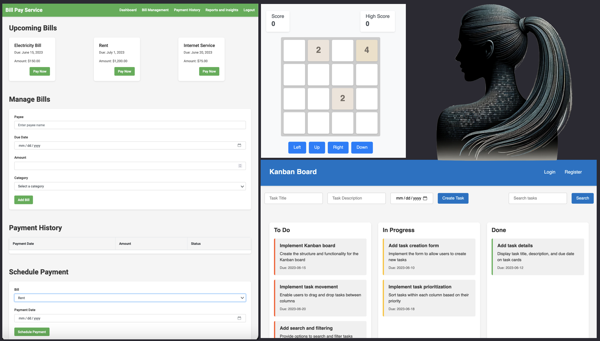

#  jemma
> hey, I am Jemma. I convert your thoughts to code


- [🧬 what I do](#-what-i-do)
- [🕹️ can I play?](#%EF%B8%8F-can-i-play)
  - [install me](#install-me)
  - [convert ideas to code](#convert-ideas-to-code)
- [🛠️ how I do it](#%EF%B8%8F-how-i-do-it)
  - [models](#models)
  - [problems](#problems)
  - [development](#development)
- [license](#license)

# 🧬 what I do

I take an idea in a form of:
* a few words, such as "`Bill Pay Service`", "`2048`" or "`Kanban Board`"
* OR a text file with requirements

and I create a web based prototype 🚀

> _in fact I just created all three 👆 (so you can quickly see what I mean):_




after the prototype is built, I take feedback and refactor it.

# 🕹️ can I play?

of course!

## install me

```
$ pip install jemma
```

add a "`.env`" file from where I am going to be called from with API keys of your choice:

```bash
export ANTHROPIC_API_KEY=sk-ant-api03...
export OPENAI_API_KEY=sk-puk...
export REPLICATE_API_TOKEN=r8_ai...
```

ready to rock! :metal:

## convert ideas to code

```
$ jemma --prompt "Bill Pay Service" --build-prototype --claude
```

I will assemble a team who will build a prototype, open a browser with it, and wait for your feedback:
```bash
Claude 🧠 claude-3-haiku-20240307 ✅

> Project Manager:
Dear Business Owner, in this meeting we'll work on creating requirements based on the 💡 idea

> Business Owner: 📚 creating detailed requirements ...🖋️

> Project Manager:
Dear Engineer, in this meeting let's put our heads together to build a prototype based on the requirements.

> Engineer: 💫 creating a prototype based on the requirements...
> Engineer: crafting css 🎨 (a.k.a. "visual beauty")
> Engineer: cooking javascript 🎮 (a.k.a. "master of interactions")
> Engineer: creating html 🕸️ (a.k.a. "the skeleton of the web")

prototype files created successfully:
- prototype/index.html
- prototype/app.js
- prototype/app.css
opened prototype in the web browser

tell me how to make it better >
```

# 🛠️ how I do it

I rely on my team of project managers, business owners and engineers<br>
yes... "AI Agents"

When I get an idea a Project Manager meets with a Business Owner to take it in and create a comprehensive set of requirements<br/>
then the Project Manager meets with an Engineer to build the idea based on these new requirements.

## models

I best work with Claude models, that is why my examples all end in "`--claude`":
```bash
$ jemma --prompt "Trivia Game" --build-prototype --claude
```
by default though I will call Ollama (gemma model):

```bash
$ jemma --prompt "Trivia Game" --build-prototype
Ollama 🧠 gemma:7b-instruct-v1.1-fp16 ✅
```

here are the default models I would use:

| model param    | default model|
|    ----        |    ----      |
| `--claude`       | `claude-3-haiku-20240307` |
| `--openai`       | `gpt-3.5-turbo`|
| `--ollama`       | `gemma:7b-instruct-v1.1-fp16`|
| `--replicate`    | `mistralai/mixtral-8x7b-instruct-v0.1`|

but you can override all of these with your (local, or not) models:

```bash
$ jemma --prompt "Trivia Game" --build-prototype --claude claude-3-opus-20240229
$ jemma --prompt "Trivia Game" --build-prototype --ollama dolphin-mistral:7b-v2.6-dpo-laser-fp16
$ jemma --prompt "Trivia Game" --build-prototype --openai gpt-4-turbo-preview
$ jemma --prompt "Trivia Game" --build-prototype --replicate meta/llama-2-70b-chat
$ ...
```

> _but, at least for now, the best results are produced with **Claude** based models_

## problems

I am still learning, so some prototypes that I build might result in errors<br/>
this would especially be likely with non Claude based models

but, we are all learning, _and_ I love feedback:

```bash
tell me how to make it better > I see an error "app.js:138: uncaught TypeError: chordProgressionData.find(...) is undefined"

> Project Manager:
Dear Engineer, we have met with the user and received a valuable feedback. sudo make it better! 🛠️

> Engineer: 💫 refactoring prototype based on the feedback...

> Engineer: ♻️  crafting css 🎨 (a.k.a. "visual beauty")

> Engineer: ♻️  cooking javascript 🎮 (a.k.a. "master of interactions")

> Engineer: ♻️  creating html 🕸️ (a.k.a. "the skeleton of the web")
prototype files created successfully:
- prototype/index.html
- prototype/app.js
- prototype/app.css
opened prototype in the web browser

tell me how to make it better >
```

_you can check for / find errors in your browser console_

>_iff you know "how to HTML", you can help fix the code as well<br/>_
>_it is often something simple: adding a CSS class, updating the "width", etc._

## development

in order to run from source<br/>
clone jemma:

```bash
$ git clone git@github.com:tolitius/jemma.git
```
and
```bash
$ cd jemma
$ python huddle.py --prompt "Code Editor" --build-prototype --claude
Claude 🧠 claude-3-haiku-20240307 ✅
...
```

# license

Copyright © 2024 tolitius

Distributed under the Eclipse Public License either version 1.0 or (at
your option) any later version.
